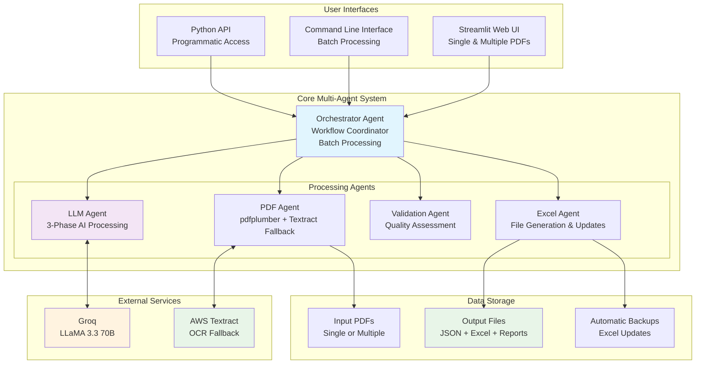
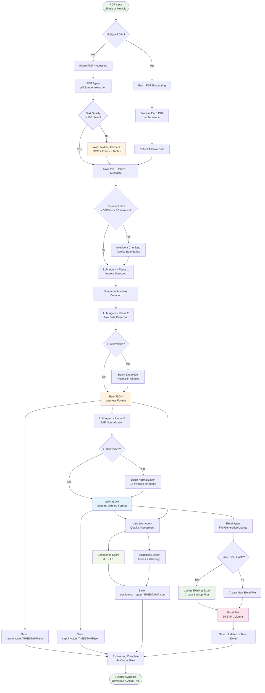
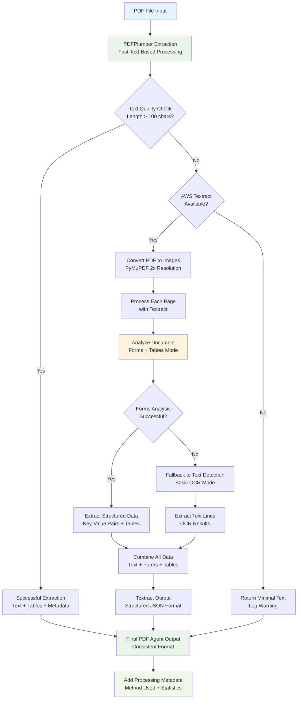
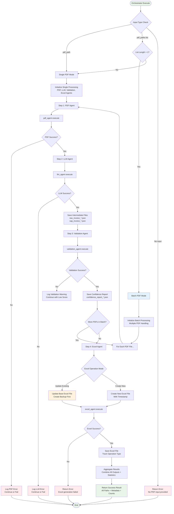
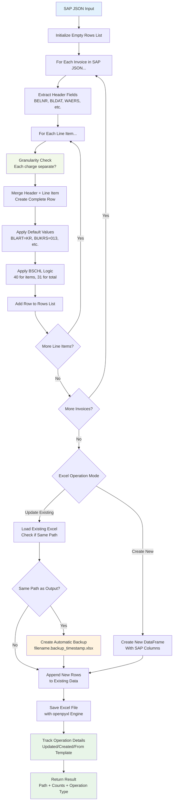
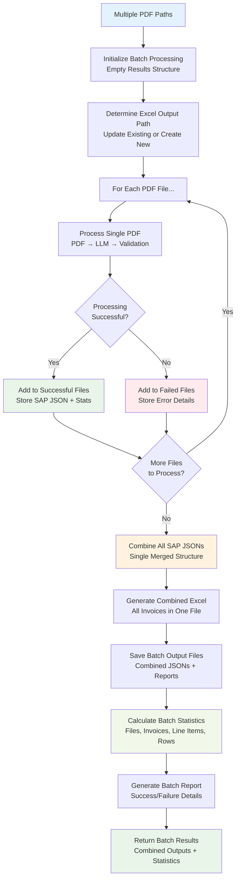
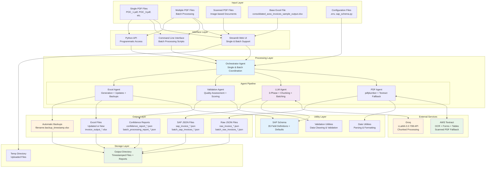

# SAP Invoice Processing System - Complete Flowcharts

This document contains comprehensive flowcharts for the SAP Invoice Processing System, showing the complete data flow, process flow, and component interactions including all recent enhancements.

---

## 1. High-Level System Architecture



---

## 2. Complete Data Flow Pipeline (Enhanced)



---

## 3. PDF Agent with Textract Fallback



---

## 4. LLM Agent Three-Phase Processing (Enhanced)

```mermaid
flowchart TD
    INPUT_TEXT[Raw Text + Tables] --> DOC_SIZE{Document Size<br/>> 50KB or > 10 invoices?}
    
    DOC_SIZE -->|Yes| CHUNKING[Intelligent Chunking<br/>Invoice Boundary Detection]
    DOC_SIZE -->|No| PHASE1[Phase 1: Detection]
    CHUNKING --> PHASE1
    
    subgraph P1 ["Phase 1: Invoice Detection"]
        PHASE1 --> DETECT_PROMPT[Detection Prompt<br/>Count invoices in document]
        DETECT_PROMPT --> GROQ1[Groq API Call 1<br/>Temperature: 0]
        GROQ1 --> DETECT_RESULT[Number of Invoices: N]
    end
    
    DETECT_RESULT --> PHASE2[Phase 2: Raw Extraction]
    
    subgraph P2 ["Phase 2: Lossless Extraction"]
        PHASE2 --> EXTRACT_PROMPT[Extraction Prompt<br/>Extract ALL invoice data]
        EXTRACT_PROMPT --> CHUNK_PROCESS{Chunked Processing?}
        CHUNK_PROCESS -->|Yes| GROQ2_BATCH[Multiple API Calls<br/>Process Each Chunk]
        CHUNK_PROCESS -->|No| GROQ2[Single API Call<br/>Full Document]
        GROQ2 --> RAW_JSON_OUT[Raw JSON Output<br/>Lossless, Unstructured]
        GROQ2_BATCH --> MERGE_CHUNKS[Merge Chunk Results]
        MERGE_CHUNKS --> RAW_JSON_OUT
    end
    
    RAW_JSON_OUT --> PHASE3[Phase 3: SAP Normalization]
    
    subgraph P3 ["Phase 3: Schema Normalization"]
        PHASE3 --> NORM_PROMPT[Normalization Prompt<br/>Apply SAP Business Rules]
        NORM_PROMPT --> BATCH_NORM_CHECK{> 10 invoices?}
        BATCH_NORM_CHECK -->|Yes| BATCH_NORM[Batch Normalization<br/>15 invoices per batch]
        BATCH_NORM_CHECK -->|No| GROQ3[Single API Call<br/>Full Normalization]
        BATCH_NORM --> GROQ3_BATCH[Multiple API Calls<br/>Normalize Batches]
        GROQ3 --> SAP_JSON_OUT[SAP JSON Output<br/>Schema-Aligned]
        GROQ3_BATCH --> MERGE_NORM[Merge Normalized Results]
        MERGE_NORM --> SAP_JSON_OUT
    end
    
    SAP_JSON_OUT --> GRANULAR_CHECK[Granularity Validation<br/>Each charge separate line item]
    GRANULAR_CHECK --> FINAL_OUTPUT[Final LLM Output<br/>Raw JSON + SAP JSON]
    
    style P1 fill:#e3f2fd
    style P2 fill:#fff3e0
    style P3 fill:#e8f5e8
    style RAW_JSON_OUT fill:#fff3e0
    style SAP_JSON_OUT fill:#e3f2fd
    style GRANULAR_CHECK fill:#f1f8e9
```



---

## 5. Orchestrator Agent Workflow (Enhanced)



---

## 6. Excel Agent Enhanced Processing



---

## 7. Batch Processing Flow



---

## 8. User Interface Flow (Enhanced Streamlit)

```mermaid
flowchart TD
    START([User Opens Streamlit App]) --> LOAD_UI[Load Web Interface<br/>Enhanced with Batch Support]
    
    LOAD_UI --> DISPLAY_FORM[Display Upload Form<br/>Single or Multiple PDF Mode]
    DISPLAY_FORM --> MODE_SELECT[User Selects Upload Mode<br/>Single PDF or Multiple PDFs]
    
    MODE_SELECT --> UPLOAD_MODE{Upload Mode<br/>Selected}
    UPLOAD_MODE -->|Single| SINGLE_UPLOAD[Single PDF File Uploader]
    UPLOAD_MODE -->|Multiple| MULTI_UPLOAD[Multiple PDF Files Uploader<br/>accept_multiple_files=True]
    
    SINGLE_UPLOAD --> FILES_UPLOADED{Files Uploaded?}
    MULTI_UPLOAD --> FILES_UPLOADED
    
    FILES_UPLOADED -->|No| MODE_SELECT
    FILES_UPLOADED -->|Yes| SHOW_CONFIG[Show Configuration<br/>Base Excel Path, Output Directory]
    
    SHOW_CONFIG --> PROCESS_BUTTON[Show Process Button<br/>Dynamic Label Based on File Count]
    PROCESS_BUTTON --> BUTTON_CLICKED{Button Clicked?}
    
    BUTTON_CLICKED -->|No| PROCESS_BUTTON
    BUTTON_CLICKED -->|Yes| SAVE_TEMP[Save Uploaded Files<br/>to Temp Directory]
    
    SAVE_TEMP --> SHOW_PROGRESS[Show Progress Spinner<br/>Processing invoice(s)...]
    SHOW_PROGRESS --> CALL_ORCHESTRATOR[Call Orchestrator<br/>Single or Batch Mode]
    
    CALL_ORCHESTRATOR --> PROCESSING{Processing<br/>Successful?}
    PROCESSING -->|No| SHOW_ERROR[Display Error Message<br/>with Detailed Information]
    PROCESSING -->|Yes| SHOW_SUCCESS[Display Success Message<br/>with Statistics]
    
    SHOW_SUCCESS --> BATCH_CHECK{Batch Processing<br/>Results?}
    BATCH_CHECK -->|Yes| DISPLAY_BATCH_TABS[Display Batch Result Tabs<br/>Rows, JSONs, Batch Report, Downloads]
    BATCH_CHECK -->|No| DISPLAY_SINGLE_TABS[Display Single Result Tabs<br/>Rows, Raw JSON, SAP JSON, Downloads]
    
    DISPLAY_BATCH_TABS --> SHOW_DOWNLOADS[Show Download Buttons<br/>All Output Files + Batch Report]
    DISPLAY_SINGLE_TABS --> SHOW_DOWNLOADS
    
    SHOW_DOWNLOADS --> WAIT_ACTION[Wait for User Action...]
    WAIT_ACTION --> DOWNLOAD_CLICKED{Download Button<br/>Clicked?}
    
    DOWNLOAD_CLICKED -->|Yes| SERVE_FILE[Serve File Download<br/>Excel, JSON, or Report]
    DOWNLOAD_CLICKED -->|No| NEW_UPLOAD{New Files<br/>Uploaded?}
    
    SERVE_FILE --> WAIT_ACTION
    NEW_UPLOAD -->|Yes| SAVE_TEMP
    NEW_UPLOAD -->|No| WAIT_ACTION
    
    SHOW_ERROR --> WAIT_ACTION
    
    style START fill:#e8f5e8
    style SHOW_SUCCESS fill:#e8f5e8
    style SHOW_ERROR fill:#ffebee
    style DISPLAY_BATCH_TABS fill:#e3f2fd
    style MULTI_UPLOAD fill:#fff3e0
    style SERVE_FILE fill:#e8f5e8
```

---

## 9. Complete System Integration Flow (Current State)



---

## Summary

These enhanced flowcharts represent the complete current state of the SAP Invoice Processing System including:

1. **Multi-Agent Architecture** - 5 specialized agents with enhanced capabilities
2. **Batch Processing** - Multiple PDF support with combined outputs
3. **AWS Textract Fallback** - Automatic OCR for scanned documents
4. **Excel Update Functionality** - Direct file updates with automatic backups
5. **Large Document Handling** - Intelligent chunking and batch normalization
6. **Enhanced UI** - Single and multiple PDF upload modes
7. **Comprehensive Error Handling** - Graceful degradation and detailed reporting
8. **Complete Audit Trail** - All intermediate outputs and processing metadata
9. **Granular Line Item Extraction** - Each charge as separate line item
10. **System Integration** - All components working together seamlessly

Each flowchart uses Mermaid syntax and provides clear visual documentation of the system's enhanced architecture and processes, reflecting all recent improvements and current capabilities.