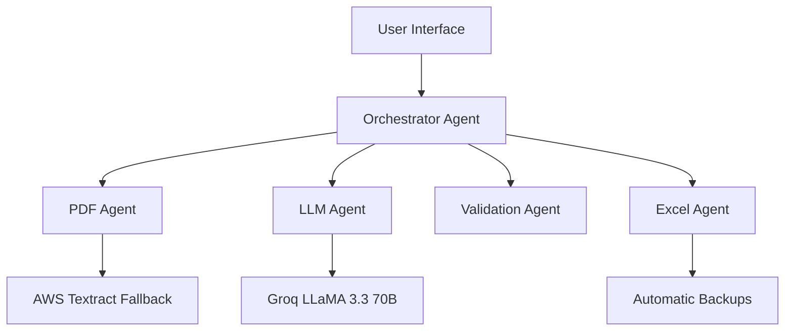

# Project Structure

## Complete File Structure

```
sap-invoice-processing-system/
│
├── .env                                    # Environment configuration
├── .gitignore                              # Git ignore rules
├── requirements.txt                        # Python dependencies
├── README.md                               # Project overview
├── PROJECT_STRUCTURE.md                    # This file
├── IMPLEMENTATION_SUMMARY.md               # Implementation summary
├── QUICKSTART.md                           # 5-minute setup guide
├── FLOWCHART.md                           # System flowcharts
├── TECHNICAL_REPORT.md                     # Technical analysis
│
├── app.py                                  # Streamlit web application
├── test_system.py                          # CLI test script
├── example_usage.py                        # Usage examples
├── verify_installation.py                  # Dependency verification
├── test_multiple_pdf.py                    # Batch processing tests
│
├── agents/                                 # Multi-agent system
│   ├── __init__.py
│   ├── base_agent.py                      # Base agent class
│   ├── pdf_agent.py                       # PDF extraction + Textract fallback
│   ├── llm_agent.py                       # 3-phase LLM processing
│   ├── excel_agent.py                     # Excel generation + updates
│   ├── validation_agent.py                # Quality assessment
│   ├── orchestrator.py                    # Workflow coordination + batch
│   └── __pycache__/                       # Python cache
│
├── config/                                 # Configuration
│   ├── __init__.py
│   ├── sap_schema.py                      # SAP schema + defaults
│   └── __pycache__/                       # Python cache
│
├── utils/                                  # Utilities
│   ├── __init__.py
│   ├── date_utils.py                      # Date parsing + formatting
│   └── validation_utils.py                # Data validation helpers
│
├── docs/                                   # Documentation
│   ├── ARCHITECTURE.md                    # System architecture
│   ├── USAGE.md                          # Usage guide
│   ├── PROMPTS.md                        # LLM prompts
│   ├── SYSTEM_FLOW.md                    # Process flows
│   ├── SAP_ACCOUNTING_LOGIC.md           # Accounting rules
│   ├── PDF_TYPES.md                      # PDF type handling
│   ├── GRANULARITY_GUIDE.md              # Line item extraction
│   ├── LARGE_DOCUMENT_HANDLING.md        # Chunking strategy
│   ├── PDF_TEXTRACT_FALLBACK.md          # Textract integration
│   └── EXCEL_UPDATE_FUNCTIONALITY.md     # Excel update features
│
├── output/                                 # Generated outputs (runtime)
│   ├── raw_invoice_TIMESTAMP.json        # Raw extraction results
│   ├── sap_invoice_TIMESTAMP.json        # SAP-normalized data
│   ├── invoice_output_TIMESTAMP.xlsx     # Final Excel files
│   ├── confidence_report_TIMESTAMP.json  # Validation reports
│   ├── batch_raw_invoices_TIMESTAMP.json # Batch raw data
│   ├── batch_sap_invoices_TIMESTAMP.json # Batch SAP data
│   ├── batch_invoice_output_TIMESTAMP.xlsx # Batch Excel output
│   └── batch_processing_report_TIMESTAMP.json # Batch statistics
│
├── temp/                                   # Temporary files (runtime)
│   └── uploaded_*.pdf                     # Temporarily stored uploads
│
├── [Sample Data]                           # Test files
│   ├── POC_1.pdf                          # Single DHL invoice (17 pages)
│   ├── POC_2.pdf                          # AmEx statement (61 pages, 50+ invoices)
│   ├── POC_3.pdf                          # Single DHL invoice (2 pages)
│   ├── POC_4.pdf                          # Single invoice
│   ├── POC_5.pdf                          # Single invoice
│   ├── POC_6.pdf                          # Single invoice
│   ├── consolidated_acss_invoices_sample_output.xlsx # Base Excel template
│   ├── Goal_Extraction(1).xlsx            # Expected outputs
│   └── download.png                       # UI logo
│
└── [Backup Files]                          # Automatic backups (runtime)
    └── *.backup_TIMESTAMP.xlsx           # Excel file backups
```

---

## File Descriptions

### **Root Configuration Files**

| File | Purpose | Content |
|------|---------|---------|
| `.env` | Environment variables | Azure OpenAI + AWS credentials |
| `requirements.txt` | Python dependencies | Core + enhanced packages |
| `.gitignore` | Git exclusions | Temp files, cache, credentials |

### **Main Application Files**

| File | Purpose | Features |
|------|---------|----------|
| `app.py` | Streamlit web UI | Single/batch upload, real-time status, downloads |
| `test_system.py` | CLI testing | Command-line batch processing |
| `example_usage.py` | Usage examples | 6 patterns from simple to advanced |
| `verify_installation.py` | Setup verification | Dependency and credential checks |

### **Documentation Files**

| File | Purpose | Content |
|------|---------|---------|
| `README.md` | Project overview | Quick start, features, badges |
| `QUICKSTART.md` | 5-minute guide | Installation and first run |
| `IMPLEMENTATION_SUMMARY.md` | What's built | Complete feature summary |
| `PROJECT_STRUCTURE.md` | This file | File organization and descriptions |
| `FLOWCHART.md` | Visual flows | Mermaid diagrams of all processes |
| `TECHNICAL_REPORT.md` | Technical analysis | Architecture and implementation details |

---

## Agent System (`agents/`)

### **Core Agents**

| Agent | File | Responsibility | Key Features |
|-------|------|---------------|--------------|
| **Orchestrator** | `orchestrator.py` | Workflow coordination | Single/batch processing, error recovery |
| **PDF** | `pdf_agent.py` | Text extraction | pdfplumber + Textract fallback |
| **LLM** | `llm_agent.py` | AI processing | 3-phase: detect → extract → normalize |
| **Validation** | `validation_agent.py` | Quality assessment | Confidence scoring, issue tracking |
| **Excel** | `excel_agent.py` | File generation | Updates, backups, row expansion |

### **Agent Architecture**



### **Base Agent Class**

```python
# agents/base_agent.py
class BaseAgent(ABC):
    def __init__(self, name: str)
    def execute(self, input_data: Dict[str, Any]) -> Dict[str, Any]
    def log_info(self, message: str)
    def log_error(self, message: str)
    def log_warning(self, message: str)
```

---

## Configuration System (`config/`)

### **SAP Schema Definition**

| Component | Purpose | Content |
|-----------|---------|---------|
| `SAP_COLUMNS` | Field list | 35 SAP column names |
| `SAP_FIELD_DESCRIPTIONS` | Documentation | Field meanings and formats |
| `PDF_PRESENT_FIELDS` | Categorization | Fields typically in PDFs |
| `INFERRED_FIELDS` | Categorization | Fields calculated/defaulted |
| `OPTIONAL_FIELDS` | Categorization | Fields not always present |
| `DEFAULT_VALUES` | Defaults | Values for missing fields |

### **Field Categories**

```python
# Example field categorization
PDF_PRESENT_FIELDS = [
    "BELNR", "BLDAT", "WAERS", "WRBTR", "SGTXT", "MENGE"
]

INFERRED_FIELDS = [
    "BUDAT", "BLART", "BUKRS", "BSCHL", "HKONT"
]

DEFAULT_VALUES = {
    "BLART": "KR",      # Vendor Invoice
    "BUKRS": "013",     # Company Code
    "BSCHL": "40",      # Line Item Posting Key
    "HKONT": "K0551"    # GL Account
}
```

---

## Utility System (`utils/`)

### **Date Utilities**

| Function | Purpose | Example |
|----------|---------|---------|
| `parse_date()` | Multi-format parsing | "15/03/2024" → "2024-03-15" |
| `format_date_iso()` | ISO formatting | Date → "YYYY-MM-DD" |
| `calculate_payment_days()` | Date difference | Invoice to due date |
| `get_current_date_iso()` | Current date | Today in ISO format |

### **Validation Utilities**

| Function | Purpose | Example |
|----------|---------|---------|
| `is_valid_currency()` | Currency validation | "USD" → True |
| `is_valid_amount()` | Numeric validation | "1,234.56" → True |
| `clean_amount()` | Amount parsing | "$1,234.56" → 1234.56 |
| `validate_sap_row()` | Row validation | Complete row check |

---

## Documentation System (`docs/`)

### **Architecture Documentation**

| File | Focus | Content |
|------|-------|---------|
| `ARCHITECTURE.md` | System design | Agent architecture, data flow |
| `SYSTEM_FLOW.md` | Process flows | Step-by-step workflows |
| `SAP_ACCOUNTING_LOGIC.md` | Business rules | Double-entry accounting |

### **Feature Documentation**

| File | Focus | Content |
|------|-------|---------|
| `PDF_TYPES.md` | Document types | Single invoice vs statements |
| `GRANULARITY_GUIDE.md` | Line items | Maximum granularity extraction |
| `LARGE_DOCUMENT_HANDLING.md` | Scalability | Chunking and batch processing |
| `PDF_TEXTRACT_FALLBACK.md` | OCR integration | Scanned PDF handling |
| `EXCEL_UPDATE_FUNCTIONALITY.md` | File management | Direct updates and backups |

### **Usage Documentation**

| File | Focus | Content |
|------|-------|---------|
| `USAGE.md` | User guide | Installation, configuration, customization |
| `PROMPTS.md` | LLM prompts | All prompts with customization guide |

---

## Output System (`output/`)

### **Single PDF Processing**

| File Pattern | Content | Purpose |
|--------------|---------|---------|
| `raw_invoice_TIMESTAMP.json` | Lossless extraction | Audit trail, debugging |
| `sap_invoice_TIMESTAMP.json` | SAP-normalized data | Business logic applied |
| `invoice_output_TIMESTAMP.xlsx` | Final Excel file | SAP integration ready |
| `confidence_report_TIMESTAMP.json` | Validation results | Quality assessment |

### **Batch PDF Processing**

| File Pattern | Content | Purpose |
|--------------|---------|---------|
| `batch_raw_invoices_TIMESTAMP.json` | Combined raw data | All files merged |
| `batch_sap_invoices_TIMESTAMP.json` | Combined SAP data | All invoices normalized |
| `batch_invoice_output_TIMESTAMP.xlsx` | Combined Excel | Single output file |
| `batch_processing_report_TIMESTAMP.json` | Batch statistics | Success/failure summary |

### **Backup System**

| File Pattern | Content | Purpose |
|--------------|---------|---------|
| `filename.backup_TIMESTAMP.xlsx` | Original Excel | Before updates |

---

## Data Flow Architecture

### **Single PDF Flow**

```
PDF File
    ↓
[PDF Agent] → pdfplumber extraction
    ↓ (if < 100 chars)
[PDF Agent] → AWS Textract fallback
    ↓
[LLM Agent] → Phase 1: Detection
    ↓
[LLM Agent] → Phase 2: Raw extraction
    ↓
[LLM Agent] → Phase 3: SAP normalization
    ↓
[Validation Agent] → Quality assessment
    ↓
[Excel Agent] → File generation/update
    ↓
Output Files (4 files)
```

### **Batch PDF Flow**

```
Multiple PDFs
    ↓
[Orchestrator] → Process each PDF
    ↓
[Collect Results] → Combine SAP JSONs
    ↓
[Excel Agent] → Single combined Excel
    ↓
Batch Output Files (4 files)
```

---

## Extension Points

### **Adding New Agents**

1. Create file in `agents/`
2. Inherit from `BaseAgent`
3. Implement `execute()` method
4. Add to orchestrator pipeline

```python
# agents/my_agent.py
from .base_agent import BaseAgent

class MyAgent(BaseAgent):
    def __init__(self):
        super().__init__("MyAgent")
    
    def execute(self, input_data):
        # Implementation
        return {"status": "success"}
```

### **Modifying SAP Schema**

1. Edit `config/sap_schema.py`
2. Update field lists and defaults
3. Modify LLM prompts in `agents/llm_agent.py`
4. Update Excel mapping in `agents/excel_agent.py`

### **Custom Validation Rules**

1. Edit `agents/validation_agent.py`
2. Add validation functions
3. Update confidence calculation
4. Modify issue categorization

### **UI Customization**

1. Edit `app.py`
2. Modify Streamlit components
3. Add new tabs or visualizations
4. Update styling and layout

---

## Key Design Principles

### **1. Agent-Based Architecture**
- **Single Responsibility**: Each agent has one clear purpose
- **Loose Coupling**: Agents communicate through JSON
- **Independent Error Handling**: Failures don't cascade
- **Easy Extension**: Add new agents without modifying existing ones

### **2. Data-Driven Design**
- **JSON as Truth**: All data flows through structured JSON
- **Schema-Driven**: No hardcoded invoice formats
- **Audit Trail**: Complete processing history preserved
- **Deterministic**: LLM only for semantic tasks

### **3. Scalability Features**
- **Chunking**: Large documents automatically split
- **Batch Processing**: Multiple files processed together
- **Memory Efficient**: Streaming and cleanup
- **Error Isolation**: Failed files don't stop batch

### **4. Production Ready**
- **Comprehensive Logging**: Detailed execution logs
- **Error Recovery**: Graceful degradation and fallbacks
- **Backup System**: Automatic backups before updates
- **Configuration Management**: Environment-based setup

---

## Development Workflow

### **Local Development**

```bash
# Setup
pip install -r requirements.txt
cp .env.example .env  # Configure credentials

# Run web UI
streamlit run app.py

# Run CLI tests
python test_system.py

# Run examples
python example_usage.py
```

### **Testing**

```bash
# Verify installation
python verify_installation.py

# Test batch processing
python test_multiple_pdf.py

# Test individual agents
python -c "from agents.pdf_agent import PDFAgent; agent = PDFAgent()"
```

### **Customization**

1. **Schema Changes**: Edit `config/sap_schema.py`
2. **Prompt Changes**: Edit `agents/llm_agent.py`
3. **UI Changes**: Edit `app.py`
4. **Validation Changes**: Edit `agents/validation_agent.py`

---

## Summary

This project structure provides:

- ✅ **Modular Architecture**: Clear separation of concerns
- ✅ **Comprehensive Documentation**: Every component documented
- ✅ **Extensible Design**: Easy to add new features
- ✅ **Production Ready**: Error handling, logging, backups
- ✅ **Multiple Interfaces**: Web UI, CLI, programmatic API
- ✅ **Complete Audit Trail**: All processing steps preserved
- ✅ **Scalable Processing**: Handles large documents and batches

The structure supports both simple usage (drag-and-drop PDF processing) and advanced customization (custom agents, modified schemas, integrated workflows).
